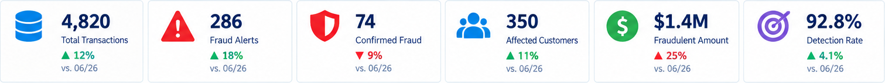
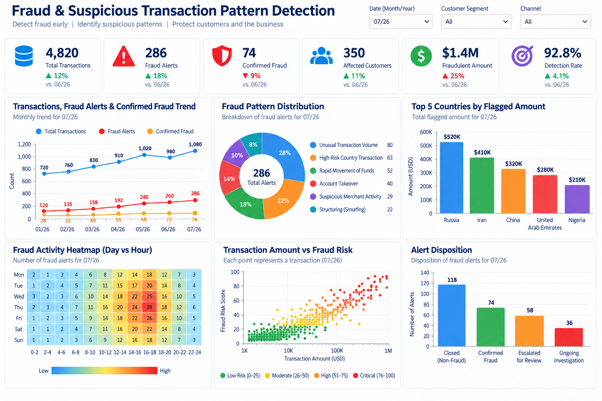
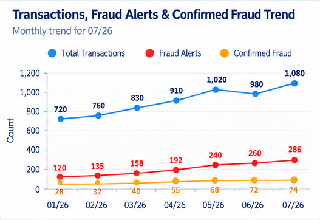
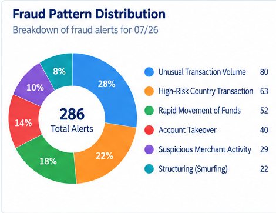

# Fraud & Suspicious Transaction Pattern Detection

End-to-end synthetic fraud analytics portfolio project built to the same presentation standard as the AML Transaction Monitoring and KYC/EDD projects.

## Scale
- 750 customers
- 28,000 transactions
- 1,628 fraud/suspicious activity alerts
- SQL + Python + Tableau + Streamlit

## Detection coverage
Velocity spikes, unusual amounts, geographic anomalies, rapid movement, account takeover indicators, repeated counterparties, cross-border behavior, and channel/merchant risk.

## Dashboard
The final executive dashboard contains six KPI cards and exactly six visualizations.

### KPI cards
Total Transactions, Fraud Alerts, Confirmed Fraud, Affected Customers, Fraudulent Amount, Detection Rate.

### Final visualizations
1. Transactions, Fraud Alerts & Confirmed Fraud Trend
2. Fraud Pattern Distribution donut
3. Top 5 Countries by Flagged Amount
4. Fraud Activity Heatmap with values inside cells
5. Transaction Amount vs Fraud Risk scatter plot
6. Alert Disposition

Dates are displayed as MM/YY, for example 07/26. No stacked bar charts are used.

## Dashboard Preview

The visuals below come directly from the executive dashboard and summarize the project's main fraud-detection findings.

### KPI Scorecard



**What it represents:** Summarizes transaction volume, fraud alerts, confirmed fraud, affected customers, fraudulent amount, and overall detection rate.

### Executive Dashboard



**What it represents:** Combines fraud trends, suspicious patterns, geographic exposure, activity timing, transaction risk, and alert outcomes in one executive view.

### Transactions, Fraud Alerts & Confirmed Fraud Trend



**What it represents:** Tracks monthly transactions, fraud alerts, and confirmed fraud to show how suspicious activity and confirmed outcomes change over time.

### Fraud Pattern Distribution



**What it represents:** Shows which suspicious transaction patterns generate the most fraud alerts, including unusual volume, high-risk countries, rapid fund movement, and account takeover.

## Streamlit

```bash
cd app
pip install -r requirements.txt
streamlit run streamlit_app.py
```

## Resume bullets
**Fraud & Suspicious Transaction Pattern Detection | SQL, Python, Tableau, Streamlit**

- Built an end-to-end fraud analytics solution across 28,000 synthetic transactions, engineering behavioral risk indicators to identify unusual amounts, velocity spikes, geographic anomalies, rapid fund movement, account-takeover signals, and repeated-counterparty activity.
- Developed explainable transaction and customer fraud-risk scoring, SQL detection queries, Tableau executive reporting, and a Streamlit investigation workbench for alert prioritization, behavioral analysis, customer review, and disposition monitoring.

## Interview explanation
“I built a fraud and suspicious-transaction analytics project that detects behavioral anomalies across transaction amount, velocity, geography, channel, device and counterparty activity. I used SQL for detection and investigation queries, Python for feature engineering and explainable risk scoring, Tableau for portfolio monitoring, and Streamlit for an investigator-style alert and customer review workflow.”

## Disclaimer
Synthetic educational portfolio project only.
